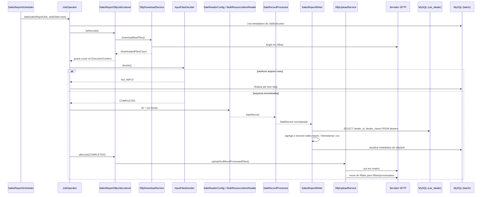

# Spring Batch em Ação

Projeto de estudo de Spring Batch da DevSuperior, construído a partir do artigo [Spring Batch em ação: processamento de grandes lotes de dados](https://devsuperior.com.br/blog/spring-batch-em-acao-processamento-de-grandes-lotes-de-dados), com foco em uma implementação prática de leitura, processamento e consolidação de arquivos CSV em lote.

> Este projeto contempla itens que o artigo original não cobre:
> 
> - Docker Compose para subir outros serviços
> - Banco de Dados MySQL para Jobs do Spring Batch
> - SFTP para comunicação entre as filiais e a matriz

O caso de uso simula uma rede de concessionárias em que cada filial envia periodicamente arquivos de vendas para uma matriz; a aplicação baixa esses arquivos via SFTP, processa os registros em lote, consolida o relatório final da matriz e publica o resultado de volta no SFTP, enquanto move os arquivos de entrada para uma pasta de processados.

## Fluxo resumido

1. `SalesReportScheduler` dispara o job em intervalo fixo.
2. `SalesReportSftpJobListener` baixa arquivos novos via `SftpDownloadService`.
3. `InputFilesDecider` decide se o job processa ou finaliza com `NO_INPUT`.
4. `SaleReaderConfig` + `MultiResourceItemReader` leem todos os CSVs baixados.
5. `SaleRecordProcessor` normaliza os dados.
6. `SalesReportWriter` agrega por filial/modelo, consulta `dealers` e gera CSV consolidado.
7. `SftpUploadService` envia o arquivo da matriz e move arquivos das filiais para `processados`.

## Diagrama de sequência



## Subindo infraestrutura local com Docker

Pré-requisitos:
- Docker Desktop com `docker compose`

Comandos (na raiz do projeto):

```bash
docker compose -f docker/docker-compose.yml up -d
docker compose -f docker/docker-compose.yml ps
```

Para parar:

```bash
docker compose -f docker/docker-compose.yml down
```

Serviços criados:
- MySQL: `localhost:3306` (`car_dealer` e `batch`)
- SFTP: `localhost:2222` (usuário `batch`)

## Simulando chegada de arquivos das filiais

Para simular novas remessas das filiais, copie os CSVs de exemplo de `src/main/resources/filial-report` para `docker/data/aurora/filiais`, que é o diretório exposto no SFTP como `/filiais`.

PowerShell:

```powershell
Copy-Item -Path .\src\main\resources\filial-report\*.csv -Destination .\docker\data\aurora\filiais\ -Force
```

Bash:

```bash
cp -f src/main/resources/filial-report/*.csv docker/data/aurora/filiais/
```

Após copiar, inicie a aplicação para ver o processamento acontecer; os arquivos devem ser movidos para `docker/data/aurora/filiais/processados` e o relatório consolidado deve aparecer em `docker/data/aurora/matriz`.

## Executando o projeto

Pré-requisitos:
- Java 25
- Docker em execução (seção anterior)

Executar com Maven Wrapper:

```powershell
.\mvnw.cmd spring-boot:run
```

```bash
./mvnw spring-boot:run
```

Com a aplicação ativa:
- O scheduler dispara a cada `5` segundos (`@Scheduled(fixedRate = 5_000)`).
- Arquivos de filial são baixados para `${user.home}/car-dealer-data/filial-report`.
- O relatório consolidado é gerado em `${user.home}/car-dealer-data/matriz-report`.

## Acesso aos bancos de dados (negócio e infraestrutura Batch)

Credenciais (conforme `application.properties` e `docker-compose`):
- Host: `localhost`
- Porta: `3306`
- Usuário: `admin`
- Senha: `admin123`

Banco de negócio (`car_dealer`):
- Tabela principal: `dealers`
- Exemplo:

```sql
SELECT * FROM car_dealer.dealers;
```

Banco de infraestrutura do Batch (`batch`):
- Tabelas principais: `BATCH_JOB_INSTANCE`, `BATCH_JOB_EXECUTION`, `BATCH_STEP_EXECUTION`
- Exemplo:

```sql
SELECT JOB_EXECUTION_ID, STATUS, CREATE_TIME
FROM batch.BATCH_JOB_EXECUTION
ORDER BY CREATE_TIME DESC
LIMIT 10;
```

Opcional via container:

```bash
docker exec -it car-dealer-mysql mysql -uadmin -padmin123
```
